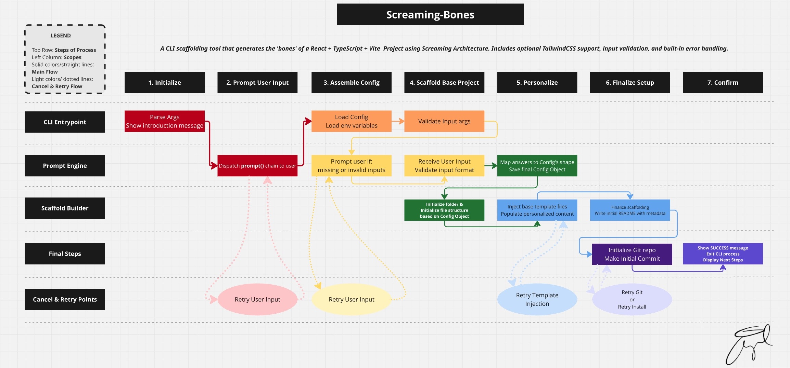

# generator-screaming-bones

A Yeoman generator for scaffolding React + TypeScript + Vite projects with ESLint, Prettier, optional Tailwind CSS, and Screaming Architecture.

## Architecture Philosophy

Screaming Architecture organizes code by business domain rather than technical layers. The folder structure communicates what the application does. Features are self-contained modules, making the codebase maintainable and domain-focused.

About screaming architecture: https://blog.cleancoder.com/uncle-bob/2011/09/30/Screaming-Architecture.html

## Requirements

- Node.js 22+
- npm 10+

## Quick Start

```bash
# Install Yeoman and the generator globally
npm install -g yo generator-screaming-bones

# Create a new project directory and navigate to it
mkdir my-new-project
cd my-new-project

# Run the generator
yo screaming-bones

# Note: You will be asked to confirm you are in the correct directory before generating a project, this is intentional.
```

## Table of Contents

- [Architecture Philosophy](#architecture-philosophy)
- [Features](#features)
- [Technical Implementation](#technical-implementation)
- [Generated Project Structure](#generated-project-structure)
- [Development Workflow](#development-workflow)
- [Roadmap](#roadmap)
- [Testing Strategy](#testing-strategy)
- [Process Flow Diagram](#process-flow-diagram)
- [License](#license)

## Features

**Generated projects include:**

- **React 19.0** with TypeScript 5.7 and modern hooks
- **Vite 6.x** for fast development and optimized builds
- **ESLint 9** with React, TypeScript, and hooks rules
- **Prettier 3.x** for consistent code formatting
- **Zero security vulnerabilities** (updated dependencies)
- **Optional Tailwind CSS** with proper configuration
- **Git repository initialization** (optional)
- **TypeScript configurations** (app and build tool configs)
- **Screaming Architecture** folder structure
- **Input validation** and error handling
- **Professional npm scripts** (dev, build, lint, format, preview)

## Technical Implementation

- **Interactive CLI:** Project name validation, Tailwind prompt, Git initialization prompt
- **Template System:** EJS-based templates with dynamic content injection
- **Error Handling:** Input validation, graceful Git failures, file operation error recovery
- **Modern Toolchain:** Latest stable versions with security-focused dependency management
- **Conditional Features:** Tailwind CSS setup only when requested
- **Yeoman Integration:** Standard generator lifecycle with proper install hooks

## Generated Project Structure

```
project-name/
├── src/
│   ├── features/                   # Domain-driven modules
│   ├── shared/
│   │   ├── infrastructure/         # Shared infrastructure code
│   │   ├── ui/
│   │   │   ├── components/         # Shared UI components
│   │   │   └── styles/             # Shared styles (reset.css)
│   │   └── types/                  # Shared TypeScript types
│   ├── assets/                     # Static assets (React logo)
│   ├── App.tsx                     # Main App component
│   ├── App.css                     # App-specific styles
│   ├── main.tsx                    # React app entry point
│   └── index.css                   # Global styles + Tailwind
├── public/                         # Public files (Vite logo, index.html)
├── tests/                          # Test suites
├── tsconfig.json                   # TypeScript configuration
├── tsconfig.node.json              # TypeScript config for build tools
├── eslint.config.js                # ESLint configuration
├── .prettierrc                     # Prettier configuration
├── vite.config.js                  # Vite configuration
├── tailwind.config.js              # Tailwind configuration (if enabled)
├── postcss.config.js               # PostCSS configuration (if Tailwind enabled)
└── package.json                    # Dependencies and scripts
```

## Development Workflow for Contributors

```bash
# Clone and setup the generator
git clone https://github.com/AngelCodes95/generator-screaming-bones.git
cd generator-screaming-bones
npm install
npm link

# Setup test directories for manual testing with and without Tailwind, if you want!
mkdir -p ../generator-test/{with-tailwind,without-tailwind}

# Switch to a test directory: cd ../generator-test/with-tailwind
# Run the generator and follow the prompts accordingly
yo screaming-bones
```

## Roadmap

- Add E2E testing and snapshot test coverage
- Optional integration steps like Storybook or CI
- More personalization modes

## Testing Strategy

This generator includes validation tests that verify core functionality without complex setup:

- **Module loading tests** - Catch syntax errors and missing dependencies early
- **Template validation** - Ensure all required EJS templates exist and compile
- **Configuration validation** - Verify JSON configs and ESLint rules are syntactically correct
- **Utility function tests** - Confirm modular components maintain expected interfaces

Run tests: `npm test`

The testing approach prioritizes fast feedback and broad coverage over complex integration scenarios, making it suitable for both development and CI environments.

## Performance (Preliminary)

- Cold start: ~2-3 seconds
- Template processing: ~500ms per file
- Total generation: 30-90 seconds

## Process Flow Diagram



[View full resolution diagram](assets/screaming-bones.png)

## License

MIT
